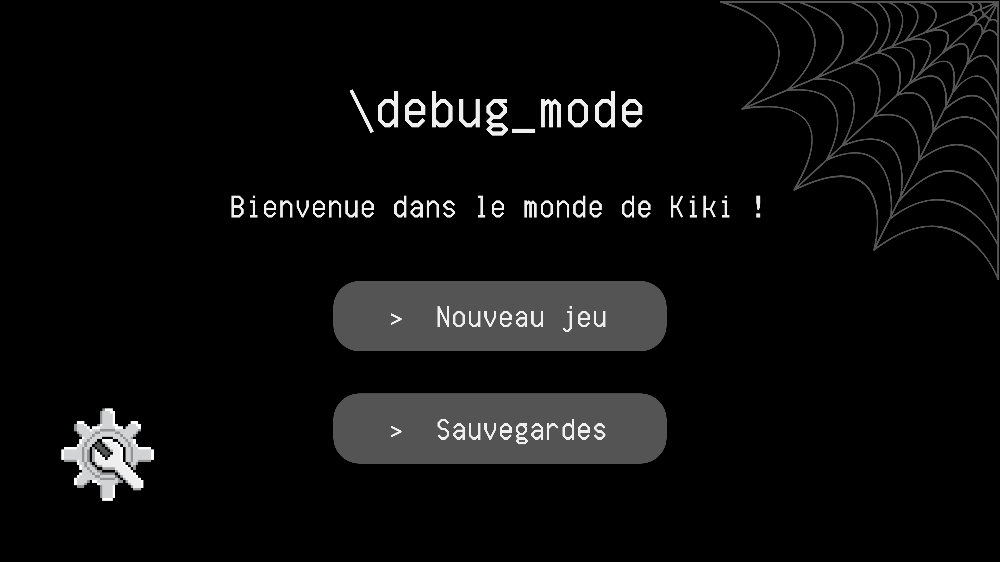
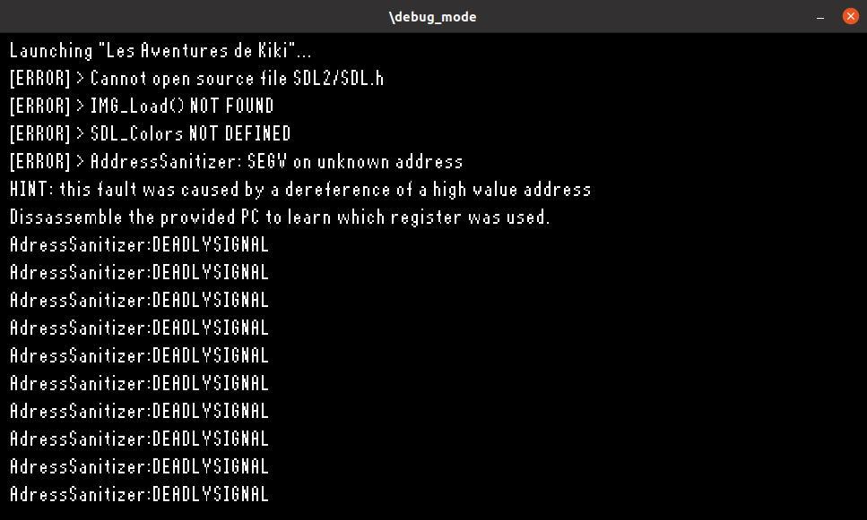
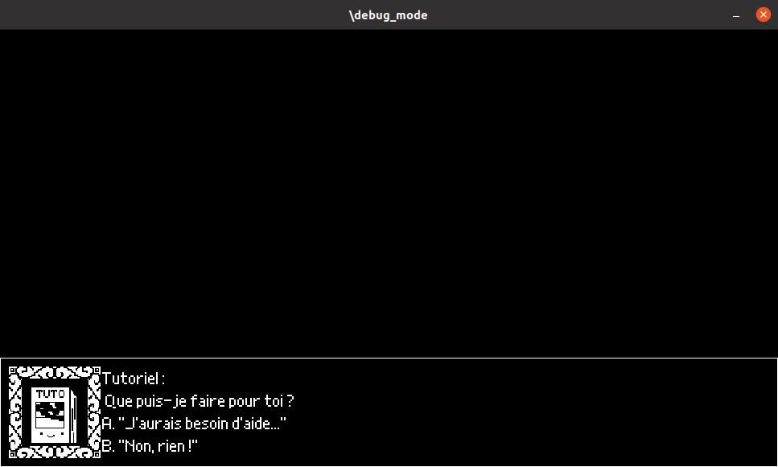

# \debug_mode

## Présentation générale

`\debug_mode` est un jeu vidéo 2D en vue à la 3e personne.

Incarnez Kiki l'araignée, et partez à l'aventure pour reconstituer son monde perdu.




## Lancement du jeu 
Pour lancer le jeu, clonez ou télécharger ce projet puis déplacez-vous dans le dossier GAME.
Vous pouvez maintenant compiler et lancer le jeu avec `make run` ou simplement le compiler avec `make`. 

Pour lancer les tests unitaire, lancez `make test`, si des erreurs se produisent dans les tests, elles s'afficheront dans le terminal. 

#### ! Si vous utilisez un Mac 
Dans le fichier `GAME/src/main.c`, il faut modifier à la première ligne la définition de `FLAGS_RENDERER` par le flag en commentaire : 

```#define FLAGS_RENDERER  SDL_RENDERER_ACCELERATED | SDL_RENDERER_PRESENTVSYNC```  
devient :  
```#define FLAGS_RENDERER SDL_RENDERER_SOFTWARE```




## About

**Membres du groupe :**
- Olivia AING <<olivia.aing@telecomnancy.eu>>
- Chloé BONINN <<chloe.boninn@telecomnancy.eu>>
- Lise MANIÈRE <<lise.maniere@telecomnancy.eu>>
- Sylvie SIDLER <<sylvie.sidler@telecomnancy.eu>>
- Zoé VERNICOS <<zoe.vernicos@telecomnancy.eu>>

